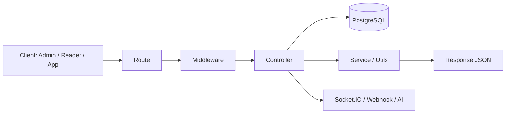
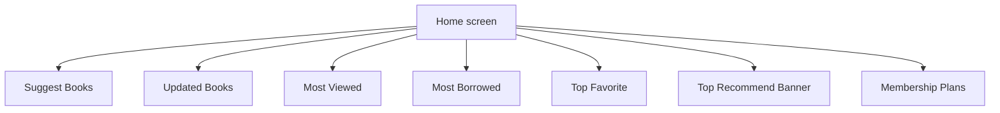
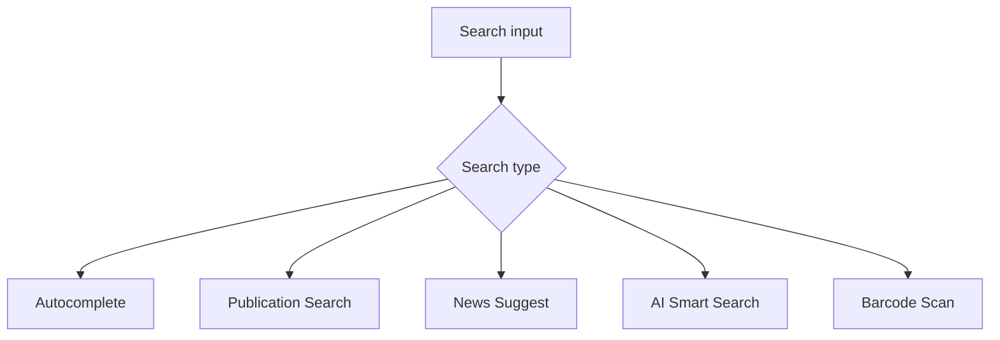
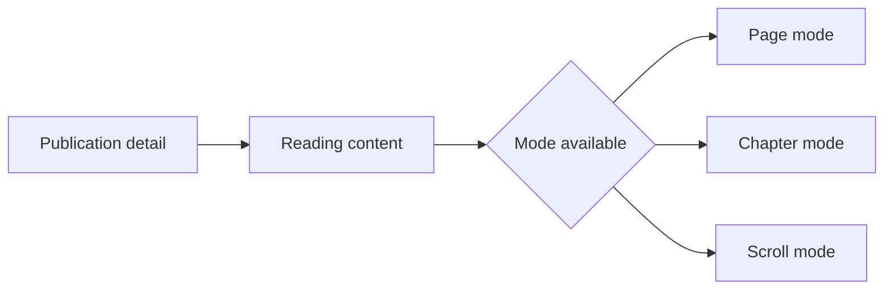
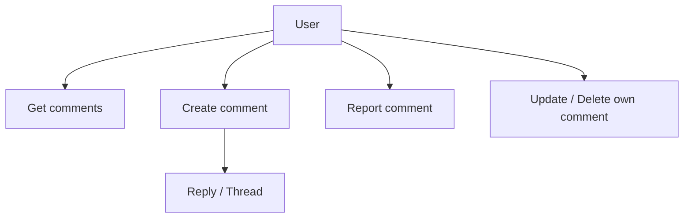
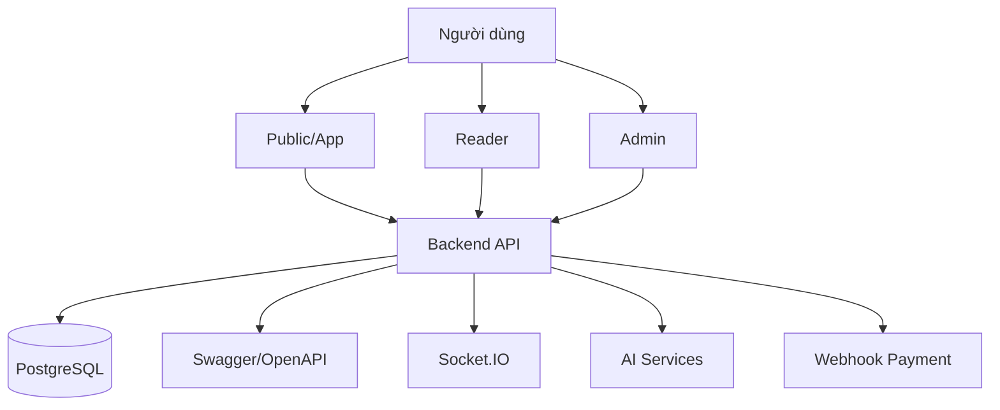
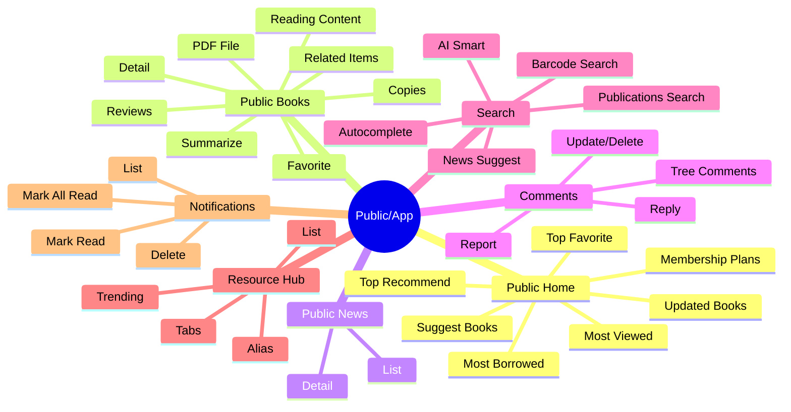
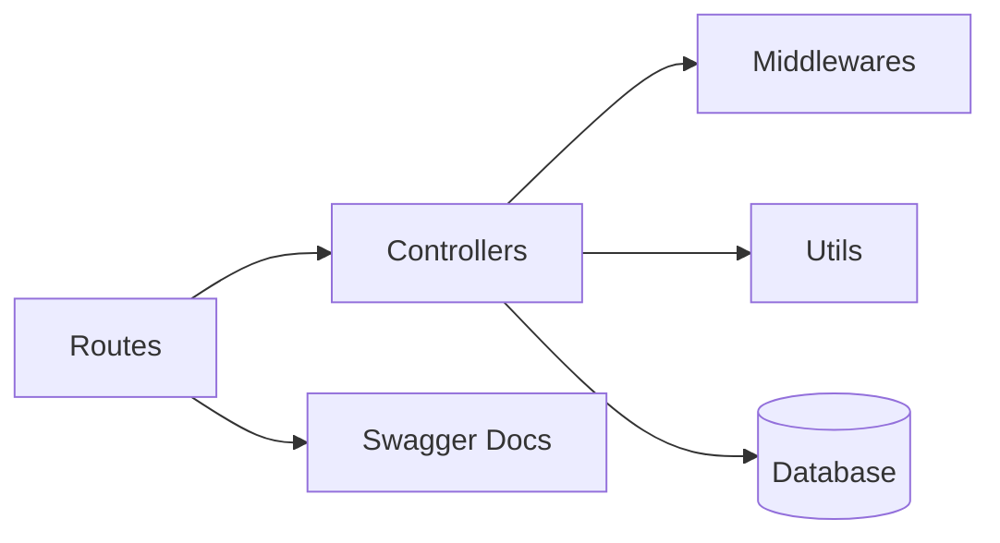

# Tài liệu mô tả hệ thống Thư viện TN

## Phiên bản
- Tên hệ thống: **Thư viện TN**
- Loại tài liệu: **Mô tả tổng quan hệ thống / tài liệu đồ án tốt nghiệp**
- Phạm vi: **Toàn bộ hệ thống backend, luồng nghiệp vụ, cấu trúc thư mục, API public/app, mô hình chức năng và định hướng triển khai**

---

## Mục lục
1. Giới thiệu đề tài
2. Mục tiêu và phạm vi hệ thống
3. Công nghệ sử dụng
4. Kiến trúc tổng thể hệ thống
5. Cấu trúc thư mục và tổ chức mã nguồn
6. Phân rã module chức năng
7. Luồng nghiệp vụ chi tiết
8. Mô hình dữ liệu và đối tượng nghiệp vụ
9. Thiết kế API và chuẩn hóa Swagger
10. Phân hệ Public/App
11. Phân hệ Admin/CMS
12. Phân hệ Reader/Bạn đọc
13. Cơ chế bảo mật và phân quyền
14. Realtime, thông báo và tích hợp ngoại vi
15. Kiểm thử, ổn định và nguyên tắc vận hành
16. Danh mục module và file mã nguồn chính
17. Bảng ánh xạ chức năng – file mã nguồn
18. Kết luận
19. Phụ lục: sơ đồ luồng và phân rã module
20. Phụ lục: checklist bàn giao cho frontend

---

## 1. Giới thiệu đề tài

Hệ thống **Thư viện TN** là một nền tảng quản lý thư viện số hóa được xây dựng theo kiến trúc web/backend hiện đại, nhằm hỗ trợ đồng thời ba nhóm người dùng chính:

- **Quản trị viên (Admin/CMS)**: vận hành, quản lý và kiểm soát dữ liệu thư viện.
- **Bạn đọc / Reader**: tra cứu, đọc online, nhận thông báo, tương tác nghiệp vụ cá nhân.
- **Người dùng công khai / Mobile App**: truy cập nội dung công khai, xem tin tức, tìm kiếm, bình luận, khai thác tài nguyên.

Hệ thống không chỉ đóng vai trò là nơi lưu trữ thông tin sách và tài liệu, mà còn là một nền tảng số hóa các nghiệp vụ thư viện: từ quản lý ấn phẩm, mượn trả, hội viên, tin tức, bình luận, thông báo đến đọc tài liệu số, tìm kiếm thông minh và tương tác realtime.

Mục tiêu của đề tài là xây dựng một hệ thống có khả năng:

- Chuẩn hóa dữ liệu thư viện.
- Tối ưu hóa quy trình tra cứu và khai thác tài liệu.
- Cung cấp trải nghiệm đọc online đa chế độ.
- Hỗ trợ giao tiếp giữa backend và frontend thông qua API rõ ràng, có swagger chi tiết.
- Dễ mở rộng cho các nghiệp vụ tương lai.

---

## 2. Mục tiêu và phạm vi hệ thống

### 2.1 Mục tiêu
Hệ thống được xây dựng để giải quyết các bài toán nghiệp vụ sau:

1. Quản lý tập trung các ấn phẩm, tài liệu, tác giả, nhà xuất bản, bộ sưu tập.
2. Phục vụ bạn đọc với khả năng đọc online, tra cứu, tìm kiếm, bình luận và theo dõi nội dung mới.
3. Hỗ trợ quản trị nội dung công khai như tin tức, thông báo, gói hội viên.
4. Cung cấp API cho app/mobile một cách rõ ràng, đồng nhất và có tài liệu chuẩn.
5. Tăng khả năng mở rộng của hệ thống thông qua kiến trúc module hóa.

### 2.2 Phạm vi
Tài liệu này tập trung vào:

- Kiến trúc phần mềm tổng thể.
- Cấu trúc mã nguồn backend.
- Phân rã chức năng nghiệp vụ.
- Mô hình API public/app và swagger.
- Luồng dữ liệu, luồng chức năng và logic xử lý.

Không đi sâu vào:

- Thiết kế UI/UX chi tiết của frontend.
- Triển khai hạ tầng production cụ thể.
- Tài liệu quản trị cơ sở dữ liệu mức SQL nội bộ từng bảng.

---

## 3. Công nghệ sử dụng

### 3.1 Backend
- **Node.js**: nền tảng chạy server JavaScript hiệu năng cao.
- **Express.js**: framework xây dựng REST API.
- **PostgreSQL**: cơ sở dữ liệu quan hệ, lưu trữ dữ liệu nghiệp vụ chính.
- **Socket.IO**: phục vụ realtime notification và các sự kiện thời gian thực.
- **Swagger / OpenAPI**: mô tả và chuẩn hóa API.

### 3.2 Frontend
- **Next.js / React**: sử dụng cho giao diện web/admin/app theo kiến trúc component.
- **TypeScript**: được sử dụng ở một số phần giao diện nhằm tăng độ an toàn kiểu dữ liệu.

### 3.3 Tích hợp và tiện ích
- **JWT Authentication**: xác thực và phân quyền người dùng.
- **Upload file / media**: lưu ảnh bìa, PDF, tài liệu số hóa, hình ảnh nội dung.
- **AI Services**: hỗ trợ tóm tắt nội dung và tìm kiếm thông minh.
- **Webhook thanh toán / đồng bộ giao dịch**: phục vụ các luồng ví và hội viên.

---

## 4. Kiến trúc tổng thể hệ thống

### 4.1 Mô hình kiến trúc logic
Hệ thống có thể mô tả theo mô hình 5 lớp:

1. **Presentation Layer**: giao diện Admin, Reader và App.
2. **API Layer**: các route REST xử lý request/response.
3. **Application Layer**: controller và middleware xử lý nghiệp vụ.
4. **Data Access Layer**: truy vấn PostgreSQL, đọc/ghi dữ liệu.
5. **Infrastructure Layer**: upload, socket, webhook, AI services.

### 4.2 Luồng xử lý tổng quát



### 4.3 Nguyên tắc kiến trúc
- Tách biệt rõ giữa các nhóm API: **Admin**, **Reader**, **Public/App**.
- Giữ luồng public/app gọn và dễ gọi cho frontend.
- Không ép nhiều section giao diện vào một response chung nếu làm mất ý nghĩa nghiệp vụ.
- Ưu tiên khả năng mở rộng và bảo trì lâu dài.

---

## 5. Cấu trúc thư mục và tổ chức mã nguồn

### 5.1 Kiến trúc thư mục backend

```text
backend/
├── database/
│   └── schema.sql
├── docs/
│   ├── he-thong-thu-vien-tn-overview.md
│   └── socketio-fe-guide.md
├── uploads/
│   ├── media/
│   ├── thumbnails/
│   ├── news/
│   └── publications/
└── src/
    ├── app.js
    ├── socket.js
    ├── config/
    │   ├── database.js
    │   ├── swagger.js
    │   └── env.js
    ├── controllers/
    │   ├── admin_ai.controller.js
    │   ├── admin_comment.controller.js
    │   ├── admin_interaction.controller.js
    │   ├── admin_library.controller.js
    │   ├── admin_notification.controller.js
    │   ├── admin_publication.controller.js
    │   ├── audit.controller.js
    │   ├── authors.controller.js
    │   ├── auth.controller.js
    │   ├── bookCategories.controller.js
    │   ├── bookLoans.controller.js
    │   ├── books.controller.js
    │   ├── borrow.controller.js
    │   ├── comment.controller.js
    │   ├── contact.controller.js
    │   ├── courseCategories.controller.js
    │   ├── courses.controller.js
    │   ├── dashboard.controller.js
    │   ├── finance.controller.js
    │   ├── homepage.controller.js
    │   ├── instructors.controller.js
    │   ├── interaction.controller.js
    │   ├── member_actions.controller.js
    │   ├── members.controller.js
    │   ├── menu.controller.js
    │   ├── membershipPlans.controller.js
    │   ├── membership_requests.controller.js
    │   ├── news.controller.js
    │   ├── newsCategories.controller.js
    │   ├── notification.controller.js
    │   ├── payments.controller.js
    │   ├── permissions.controller.js
    │   ├── publishers.controller.js
    │   ├── public_home.controller.js
    │   ├── public_news.controller.js
    │   ├── public_publication.controller.js
    │   ├── public_resource.controller.js
    │   ├── public_search.controller.js
    │   ├── reader.controller.js
    │   ├── reader_action.controller.js
    │   ├── roles.controller.js
    │   ├── search.controller.js
    │   ├── settings.controller.js
    │   ├── testimonials.controller.js
    │   ├── translation.controller.js
    │   ├── upload.controller.js
    │   ├── users.controller.js
    │   └── webhook.controller.js
    ├── middlewares/
    │   ├── auth.middleware.js
    │   ├── error.middleware.js
    │   └── validation.middleware.js
    ├── routes/
    │   ├── admin_ai.routes.js
    │   ├── admin_comment.routes.js
    │   ├── admin_library.routes.js
    │   ├── admin_notification.routes.js
    │   ├── admin_publication.routes.js
    │   ├── audit.routes.js
    │   ├── authors.routes.js
    │   ├── auth.routes.js
    │   ├── bookCategories.routes.js
    │   ├── bookLoans.routes.js
    │   ├── books.routes.js
    │   ├── borrow.routes.js
    │   ├── collection.routes.js
    │   ├── contact.routes.js
    │   ├── courseCategories.routes.js
    │   ├── courses.routes.js
    │   ├── dashboard.routes.js
    │   ├── health.routes.js
    │   ├── homepage.routes.js
    │   ├── instructors.routes.js
    │   ├── member_actions.routes.js
    │   ├── members.routes.js
    │   ├── menu.routes.js
    │   ├── mediaFiles.routes.js
    │   ├── mediaFolders.routes.js
    │   ├── membershipPlans.routes.js
    │   ├── membership_requests.routes.js
    │   ├── news.routes.js
    │   ├── newsCategories.routes.js
    │   ├── permissions.routes.js
    │   ├── payments.routes.js
    │   ├── public_comment.routes.js
    │   ├── public_home.routes.js
    │   ├── public_news.routes.js
    │   ├── public_notification.routes.js
    │   ├── public_publication.routes.js
    │   ├── public_resource.routes.js
    │   ├── public_search.routes.js
    │   ├── publishers.routes.js
    │   ├── reader.routes.js
    │   ├── reader_action.routes.js
    │   ├── roles.routes.js
    │   ├── settings.routes.js
    │   ├── testimonials.routes.js
    │   ├── translation.routes.js
    │   ├── upload.routes.js
    │   ├── users.routes.js
    │   └── webhook.routes.js
    ├── utils/
    │   ├── apiResponse.js
    │   ├── pagination.js
    │   └── textParser.js
    └── ...
```

### 5.2 Phân tích vai trò từng thư mục

#### 5.2.1 `database/`
Thư mục này chứa file định nghĩa cấu trúc cơ sở dữ liệu ban đầu, thường là `schema.sql`. Đây là nơi mô tả các bảng, khóa chính, khóa ngoại, kiểu dữ liệu và ràng buộc nghiệp vụ nền. Việc tách riêng phần schema giúp chuẩn hóa quá trình khởi tạo dữ liệu và đảm bảo có thể tái tạo hệ thống khi cần.

#### 5.2.2 `docs/`
Chứa tài liệu kỹ thuật, tài liệu bàn giao và tài liệu hỗ trợ tích hợp. Đây là khu vực quan trọng giúp mô tả hệ thống cho người phát triển, giảng viên, khách hàng hoặc nhóm FE.

#### 5.2.3 `uploads/`
Lưu các file được tải lên như ảnh bìa, ảnh tin tức, PDF, media số hóa, thumbnail và các tệp phục vụ hiển thị nội dung trên giao diện.

#### 5.2.4 `src/`
Đây là thư mục lõi của backend, nơi tập trung toàn bộ mã nguồn xử lý ứng dụng. Tại đây chứa entrypoint của hệ thống, cấu hình, controller, route, middleware, utility và các thành phần hỗ trợ khác.

#### 5.2.5 `src/app.js`
Là file khởi tạo ứng dụng Express, chịu trách nhiệm nạp middleware, route, cấu hình CORS, body parser, xử lý lỗi và khởi động server.

#### 5.2.6 `src/socket.js`
Chứa cấu hình realtime socket, dùng để phát sự kiện thông báo hoặc trạng thái tức thời đến client.

#### 5.2.7 `src/config/`
Chứa các cấu hình dùng chung như kết nối cơ sở dữ liệu, cấu hình Swagger/OpenAPI, các tham số môi trường và các helper phục vụ runtime.

#### 5.2.8 `src/controllers/`
Đây là nơi tập trung logic nghiệp vụ theo từng domain chức năng. Mỗi controller đảm nhiệm một nhóm chức năng riêng.

##### Nhóm controller quản trị
- `admin_ai.controller.js`
- `admin_comment.controller.js`
- `admin_interaction.controller.js`
- `admin_library.controller.js`
- `admin_notification.controller.js`
- `admin_publication.controller.js`
- `audit.controller.js`
- `dashboard.controller.js`

##### Nhóm controller nghiệp vụ thư viện
- `authors.controller.js`
- `books.controller.js`
- `bookLoans.controller.js`
- `borrow.controller.js`
- `bookCategories.controller.js`
- `courseCategories.controller.js`
- `courses.controller.js`
- `finance.controller.js`
- `members.controller.js`
- `membershipPlans.controller.js`
- `membership_requests.controller.js`
- `news.controller.js`
- `newsCategories.controller.js`
- `payments.controller.js`
- `publishers.controller.js`
- `roles.controller.js`
- `users.controller.js`

##### Nhóm controller public/app
- `public_home.controller.js`
- `public_news.controller.js`
- `public_publication.controller.js`
- `public_resource.controller.js`
- `public_search.controller.js`
- `comment.controller.js`
- `notification.controller.js`
- `reader.controller.js`
- `reader_action.controller.js`
- `search.controller.js`
- `interaction.controller.js`

##### Nhóm controller hỗ trợ khác
- `auth.controller.js`
- `contact.controller.js`
- `homepage.controller.js`
- `instructors.controller.js`
- `member_actions.controller.js`
- `menu.controller.js`
- `permissions.controller.js`
- `settings.controller.js`
- `testimonials.controller.js`
- `translation.controller.js`
- `upload.controller.js`
- `webhook.controller.js`

#### 5.2.9 `src/middlewares/`
Nơi đặt các lớp trung gian để xác thực token, kiểm tra quyền truy cập, kiểm tra dữ liệu đầu vào, xử lý lỗi và kiểm soát luồng request trước khi vào controller.

#### 5.2.10 `src/routes/`
Chứa định nghĩa endpoint API và ánh xạ URL vào controller. Đây là lớp giao tiếp trực tiếp với frontend, vì vậy swagger thường được mô tả cùng với route để đảm bảo đồng bộ giữa code và tài liệu.

##### Nhóm route quản trị
- `admin_ai.routes.js`
- `admin_comment.routes.js`
- `admin_library.routes.js`
- `admin_notification.routes.js`
- `admin_publication.routes.js`
- `audit.routes.js`
- `authors.routes.js`
- `auth.routes.js`
- `bookCategories.routes.js`
- `bookLoans.routes.js`
- `books.routes.js`
- `borrow.routes.js`
- `collection.routes.js`
- `contact.routes.js`
- `courseCategories.routes.js`
- `courses.routes.js`
- `dashboard.routes.js`
- `homepage.routes.js`
- `instructors.routes.js`
- `member_actions.routes.js`
- `members.routes.js`
- `menu.routes.js`
- `mediaFiles.routes.js`
- `mediaFolders.routes.js`
- `membershipPlans.routes.js`
- `membership_requests.routes.js`
- `news.routes.js`
- `newsCategories.routes.js`
- `permissions.routes.js`
- `payments.routes.js`
- `publishers.routes.js`
- `reader.routes.js`
- `reader_action.routes.js`
- `roles.routes.js`
- `settings.routes.js`
- `testimonials.routes.js`
- `translation.routes.js`
- `upload.routes.js`
- `users.routes.js`
- `webhook.routes.js`

##### Nhóm route public/app
- `public_comment.routes.js`
- `public_home.routes.js`
- `public_news.routes.js`
- `public_notification.routes.js`
- `public_publication.routes.js`
- `public_resource.routes.js`
- `public_search.routes.js`

##### Nhóm route hệ thống
- `health.routes.js`

#### 5.2.11 `src/utils/`
Chứa các tiện ích dùng chung như chuẩn response API, phân trang, xử lý chuỗi, chuyển đổi dữ liệu, helper phục vụ tính toán hoặc format.

### 5.3 Ý nghĩa của kiến trúc file
Cấu trúc này giúp đảm bảo các mục tiêu sau:

- **Dễ định vị mã nguồn**: mỗi chức năng có vị trí riêng, tránh chồng chéo.
- **Dễ bảo trì**: khi cần sửa một luồng nghiệp vụ, lập trình viên dễ tìm đúng controller hoặc route tương ứng.
- **Dễ mở rộng**: bổ sung module mới mà không phá vỡ cấu trúc cũ.
- **Dễ kiểm thử**: phân tách rõ lớp route, controller, middleware giúp việc kiểm thử độc lập hiệu quả hơn.
- **Dễ đồng bộ tài liệu**: route và swagger nằm gần nhau nên hạn chế sai lệch giữa mô tả và hiện thực.
- **Phù hợp đồ án tốt nghiệp**: cách tổ chức rõ ràng, khoa học và thể hiện được tính hệ thống của sản phẩm.

### 5.4 Mối liên hệ giữa các lớp trong mã nguồn
Kiến trúc thư mục không chỉ là cách lưu file, mà còn thể hiện cách hệ thống vận hành:

- **Route** nhận request từ client.
- **Middleware** kiểm tra quyền và dữ liệu.
- **Controller** xử lý nghiệp vụ.
- **Database** cung cấp dữ liệu bền vững.
- **Utils/Config** hỗ trợ xử lý dùng chung.
- **Docs/Swagger** mô tả hợp đồng giao tiếp giữa backend và frontend.

### 5.5 Ý nghĩa đối với quá trình phát triển đồ án
Trong bối cảnh đồ án tốt nghiệp, việc tổ chức mã nguồn như trên giúp chứng minh rằng:

- hệ thống có kiến trúc rõ ràng,
- có phân rã chức năng hợp lý,
- có khả năng triển khai thực tế,
- có tài liệu phục vụ bàn giao và bảo trì lâu dài.

---

## 6. Phân rã module chức năng

### 6.1 Nhóm Public/App
Nhóm này phục vụ app và nội dung công khai.

- **Public Home**: nội dung trang chủ.
- **Public Books**: chi tiết ấn phẩm và đọc online.
- **Public News**: tin tức công khai.
- **Comments**: bình luận đa tầng.
- **Public Search**: tìm kiếm cơ bản, AI, barcode.
- **Public Resource**: resource hub và điều hướng nội dung.
- **Public Notification**: thông báo cá nhân cho app.

### 6.2 Nhóm Admin/CMS
- Quản lý ấn phẩm.
- Quản lý tin tức.
- Quản lý bình luận.
- Quản lý hội viên.
- Quản lý thanh toán.
- Quản lý media.
- Quản lý danh mục, tác giả, nhà xuất bản.
- Theo dõi log và hoạt động hệ thống.

### 6.3 Nhóm Reader
- Hồ sơ cá nhân.
- Mượn trả.
- Gia hạn.
- Giao dịch ví.
- Thông báo cá nhân.
- Tương tác với ấn phẩm.

---

## 7. Luồng nghiệp vụ chi tiết

## 7.1 Luồng trang chủ
Trang chủ được chia thành nhiều section độc lập:
- Sách đề xuất.
- Sách mới cập nhật.
- Sách xem nhiều.
- Sách mượn nhiều.
- Sách nổi bật / yêu thích.
- Banner đề cử.
- Gói hội viên.

### Ý nghĩa
Trang chủ đóng vai trò điểm vào hệ thống, giúp người dùng tiếp cận nhanh nội dung có giá trị và điều hướng sang các màn chi tiết.

### Sơ đồ luồng



---

## 7.2 Luồng tra cứu và tìm kiếm
Hệ thống hỗ trợ nhiều hình thức tìm kiếm:
- Autocomplete.
- Tìm ấn phẩm.
- Tìm tin tức.
- Tìm bằng AI.
- Tra cứu bằng barcode/QR.

### Ý nghĩa
Người dùng có thể tra cứu nhanh theo nhiều ngữ cảnh khác nhau, từ từ khóa ngắn đến câu hỏi tự nhiên hoặc quét mã.

### Sơ đồ luồng



---

## 7.3 Luồng chi tiết ấn phẩm
Khi người dùng mở một ấn phẩm, hệ thống cung cấp:
- metadata,
- tác giả,
- nhà xuất bản,
- tài liệu liên quan,
- bản sao vật lý,
- nút yêu thích,
- review/bình luận,
- dữ liệu đọc online,
- file PDF nếu có quyền.

### Ý nghĩa
Đây là màn hình trung tâm cho việc khai thác tài liệu.

---

## 7.4 Luồng đọc online
Hệ thống hỗ trợ 3 chế độ đọc:
- **Page mode**: đọc theo trang.
- **Chapter mode**: đọc theo chương.
- **Scroll mode**: đọc cuộn toàn văn.

### Ý nghĩa
Phù hợp với nhiều loại tài liệu và trải nghiệm mobile.

### Sơ đồ luồng



---

## 7.5 Luồng tin tức
Tin tức công khai phục vụ:
- cập nhật hoạt động thư viện,
- tin sự kiện,
- nội dung truyền thông,
- thông báo chuyên môn.

### Luồng nghiệp vụ
- Hiển thị danh sách tin tức.
- Xem chi tiết bài viết.
- Có thể kèm ảnh, gallery, SEO metadata.

---

## 7.6 Luồng bình luận
Người dùng có thể:
- xem bình luận,
- trả lời bình luận,
- sửa/xóa comment của mình,
- báo cáo vi phạm.

### Ý nghĩa
Tăng tương tác và hỗ trợ kiểm duyệt nội dung.

### Sơ đồ luồng



---

## 7.7 Luồng thông báo
Thông báo cá nhân được dùng cho:
- nhắc hạn,
- nhắc gia hạn,
- thông báo thanh toán,
- thông báo hệ thống,
- cảnh báo nghiệp vụ.

### Ý nghĩa
Tăng mức độ kết nối giữa hệ thống và người dùng.

---

## 7.8 Luồng gói hội viên
Gói hội viên hỗ trợ:
- nâng cấp quyền truy cập,
- tăng số sách được mượn,
- đọc số,
- tải offline,
- ưu tiên hỗ trợ.

### Ý nghĩa
Là cơ chế nâng cao trải nghiệm và tạo lớp dịch vụ cho thư viện số.

---

## 7.9 Luồng Resource Hub
Resource Hub tổ chức tài nguyên theo:
- tab,
- trending,
- alias,
- chuyên mục khám phá.

### Ý nghĩa
Giúp người dùng duyệt tài nguyên theo ngữ cảnh và mức độ quan tâm.

---

## 8. Mô hình dữ liệu và đối tượng nghiệp vụ

Các thực thể nghiệp vụ chính gồm:

- **Publication / Book**: ấn phẩm, tài liệu.
- **Author**: tác giả.
- **Publisher**: nhà xuất bản.
- **News**: tin tức.
- **Comment**: bình luận.
- **Notification**: thông báo.
- **Membership Plan**: gói hội viên.
- **Resource**: tài nguyên/hub.
- **User / Reader**: người dùng.
- **Payment / Wallet**: thanh toán và ví.
- **MediaFile**: tệp media / PDF / ảnh.

### 8.1 Tính chất dữ liệu
- Một số trường là text thuần.
- Một số trường là JSONB để hỗ trợ đa ngôn ngữ.
- Một số field mang tính động theo ngữ cảnh hiển thị.

### 8.2 Nguyên tắc mô hình hóa
- Tách dữ liệu hiển thị và dữ liệu nghiệp vụ.
- Giữ tính linh hoạt cho FE.
- Không làm mất thông tin nguồn.

---

## 9. Thiết kế API và chuẩn hóa Swagger

Swagger được dùng như tài liệu giao diện hợp đồng giữa backend và frontend.

### 9.1 Mục tiêu
- Mô tả endpoint rõ ràng.
- Mô tả request/response đúng thực tế.
- Có example để FE triển khai nhanh.
- Hạn chế nhầm lẫn giữa các section.

### 9.2 Nguyên tắc chuẩn hóa
- Public Home giữ response riêng từng section.
- Public Books tách rõ detail, reading-content, pdf-file.
- News và Comments có schema riêng.
- Search, Resource, Notification có response đúng use-case.
- Không trộn dữ liệu khiến frontend khó tích hợp.

---

## 10. Phân hệ Public/App

Đây là phần quan trọng nhất đối với người dùng cuối và app mobile.

### 10.1 Public Home
Cung cấp các block hiển thị trên trang chủ.

### 10.2 Public Books
Cung cấp chi tiết ấn phẩm, các chế độ đọc, file PDF, review, favorite.

### 10.3 Public News
Cung cấp danh sách và chi tiết tin tức.

### 10.4 Comments
Cung cấp thread bình luận, reply, report.

### 10.5 Public Search
Cung cấp autocomplete, tìm kiếm thông minh, barcode, search news/publications.

### 10.6 Public Resource
Cung cấp hub tài nguyên và tab điều hướng.

### 10.7 Public Notification
Cung cấp thông báo cá nhân và thao tác đã đọc / xóa.

---

## 11. Phân hệ Admin/CMS

Phân hệ này phục vụ quản lý nội dung và vận hành.

### Các nghiệp vụ điển hình
- Quản lý ấn phẩm.
- Quản lý tin tức.
- Quản lý bình luận.
- Quản lý tài nguyên.
- Quản lý gói hội viên.
- Quản lý thanh toán.
- Quản lý thông báo.
- Quản lý người dùng.
- Quản lý danh mục, tác giả, nhà xuất bản.
- Theo dõi log và hoạt động hệ thống.

---

## 12. Phân hệ Reader/Bạn đọc

Phân hệ này hướng đến user đã đăng nhập.

### Chức năng
- Xem và cập nhật hồ sơ.
- Theo dõi giao dịch.
- Nhận thông báo.
- Mượn/trả/gia hạn.
- Tương tác bình luận, review, favorite.

---

## 13. Cơ chế bảo mật và phân quyền

Hệ thống sử dụng JWT và middleware xác thực để phân tách quyền truy cập.

### 13.1 Phân quyền cơ bản
- **Public**: không cần đăng nhập.
- **Reader/App**: cần token.
- **Admin**: cần quyền quản trị.

### 13.2 Mục tiêu bảo mật
- Ngăn truy cập trái phép.
- Bảo vệ dữ liệu riêng tư.
- Đảm bảo luồng comment, notification, profile, thanh toán an toàn.

---

## 14. Realtime, thông báo và tích hợp ngoại vi

### 14.1 Realtime
Socket.IO dùng cho:
- thông báo đến người dùng,
- cập nhật trạng thái liên quan,
- đồng bộ thao tác thời gian thực.

### 14.2 Tích hợp ngoại vi
- Webhook thanh toán.
- Đồng bộ giao dịch ví.
- AI service.

---

## 15. Kiểm thử, ổn định và nguyên tắc vận hành

### 15.1 Mục tiêu vận hành
- Backend ổn định.
- Luồng API rõ ràng.
- Swagger đủ để FE call.
- Không lặp, không trùng, không phá vỡ luồng cũ.

### 15.2 Nguyên tắc ổn định
- Chỉ bổ sung phần thiếu.
- Không thay đổi logic nếu không cần thiết.
- Giữ format response theo từng section.
- Kiểm tra null/empty ở FE khi triển khai.

### 15.3 Kiểm thử khuyến nghị
- Kiểm thử API public/app.
- Kiểm thử auth token.
- Kiểm thử file PDF/range.
- Kiểm thử search và autocomplete.
- Kiểm thử comment tree.
- Kiểm thử notification unread count.

---

## 16. Danh mục module và file mã nguồn chính

### 16.1 File khởi động và cấu hình
- `backend/src/app.js`
- `backend/src/socket.js`
- `backend/src/config/database.js`
- `backend/src/config/swagger.js`
- `backend/src/config/env.js`

### 16.2 File API public/app
- `backend/src/routes/public_home.routes.js`
- `backend/src/routes/public_news.routes.js`
- `backend/src/routes/public_notification.routes.js`
- `backend/src/routes/public_publication.routes.js`
- `backend/src/routes/public_resource.routes.js`
- `backend/src/routes/public_search.routes.js`
- `backend/src/routes/public_comment.routes.js`

### 16.3 File controller public/app
- `backend/src/controllers/public_home.controller.js`
- `backend/src/controllers/public_news.controller.js`
- `backend/src/controllers/public_publication.controller.js`
- `backend/src/controllers/public_resource.controller.js`
- `backend/src/controllers/public_search.controller.js`
- `backend/src/controllers/search.controller.js`
- `backend/src/controllers/comment.controller.js`
- `backend/src/controllers/notification.controller.js`
- `backend/src/controllers/reader.controller.js`
- `backend/src/controllers/reader_action.controller.js`
- `backend/src/controllers/interaction.controller.js`

### 16.4 File controller quản trị
- `backend/src/controllers/admin_ai.controller.js`
- `backend/src/controllers/admin_comment.controller.js`
- `backend/src/controllers/admin_interaction.controller.js`
- `backend/src/controllers/admin_library.controller.js`
- `backend/src/controllers/admin_notification.controller.js`
- `backend/src/controllers/admin_publication.controller.js`
- `backend/src/controllers/audit.controller.js`
- `backend/src/controllers/auth.controller.js`
- `backend/src/controllers/authors.controller.js`
- `backend/src/controllers/bookCategories.controller.js`
- `backend/src/controllers/bookLoans.controller.js`
- `backend/src/controllers/books.controller.js`
- `backend/src/controllers/borrow.controller.js`
- `backend/src/controllers/contact.controller.js`
- `backend/src/controllers/courseCategories.controller.js`
- `backend/src/controllers/courses.controller.js`
- `backend/src/controllers/dashboard.controller.js`
- `backend/src/controllers/finance.controller.js`
- `backend/src/controllers/homepage.controller.js`
- `backend/src/controllers/instructors.controller.js`
- `backend/src/controllers/member_actions.controller.js`
- `backend/src/controllers/members.controller.js`
- `backend/src/controllers/menu.controller.js`
- `backend/src/controllers/membershipPlans.controller.js`
- `backend/src/controllers/membership_requests.controller.js`
- `backend/src/controllers/news.controller.js`
- `backend/src/controllers/newsCategories.controller.js`
- `backend/src/controllers/payments.controller.js`
- `backend/src/controllers/permissions.controller.js`
- `backend/src/controllers/publishers.controller.js`
- `backend/src/controllers/roles.controller.js`
- `backend/src/controllers/settings.controller.js`
- `backend/src/controllers/testimonials.controller.js`
- `backend/src/controllers/translation.controller.js`
- `backend/src/controllers/upload.controller.js`
- `backend/src/controllers/users.controller.js`
- `backend/src/controllers/webhook.controller.js`

### 16.5 File route quản trị
- `backend/src/routes/admin_ai.routes.js`
- `backend/src/routes/admin_comment.routes.js`
- `backend/src/routes/admin_library.routes.js`
- `backend/src/routes/admin_notification.routes.js`
- `backend/src/routes/admin_publication.routes.js`
- `backend/src/routes/audit.routes.js`
- `backend/src/routes/auth.routes.js`
- `backend/src/routes/authors.routes.js`
- `backend/src/routes/bookCategories.routes.js`
- `backend/src/routes/bookLoans.routes.js`
- `backend/src/routes/books.routes.js`
- `backend/src/routes/borrow.routes.js`
- `backend/src/routes/collection.routes.js`
- `backend/src/routes/contact.routes.js`
- `backend/src/routes/courseCategories.routes.js`
- `backend/src/routes/courses.routes.js`
- `backend/src/routes/dashboard.routes.js`
- `backend/src/routes/health.routes.js`
- `backend/src/routes/homepage.routes.js`
- `backend/src/routes/instructors.routes.js`
- `backend/src/routes/member_actions.routes.js`
- `backend/src/routes/members.routes.js`
- `backend/src/routes/menu.routes.js`
- `backend/src/routes/mediaFiles.routes.js`
- `backend/src/routes/mediaFolders.routes.js`
- `backend/src/routes/membershipPlans.routes.js`
- `backend/src/routes/membership_requests.routes.js`
- `backend/src/routes/news.routes.js`
- `backend/src/routes/newsCategories.routes.js`
- `backend/src/routes/permissions.routes.js`
- `backend/src/routes/payments.routes.js`
- `backend/src/routes/publishers.routes.js`
- `backend/src/routes/reader.routes.js`
- `backend/src/routes/reader_action.routes.js`
- `backend/src/routes/roles.routes.js`
- `backend/src/routes/settings.routes.js`
- `backend/src/routes/testimonials.routes.js`
- `backend/src/routes/translation.routes.js`
- `backend/src/routes/upload.routes.js`
- `backend/src/routes/users.routes.js`
- `backend/src/routes/webhook.routes.js`

### 16.6 File hệ thống và tài liệu
- `backend/database/schema.sql`
- `backend/docs/he-thong-thu-vien-tn-overview.md`
- `backend/docs/socketio-fe-guide.md`
- `backend/uploads/`

---

## 17. Bảng ánh xạ chức năng – file mã nguồn

| Nhóm chức năng | File chính |
|---|---|
| Khởi động app | `backend/src/app.js` |
| Realtime socket | `backend/src/socket.js` |
| Swagger | `backend/src/config/swagger.js` |
| Kết nối DB | `backend/src/config/database.js` |
| Trang chủ public | `backend/src/controllers/public_home.controller.js`, `backend/src/routes/public_home.routes.js` |
| Tin tức public | `backend/src/controllers/public_news.controller.js`, `backend/src/routes/public_news.routes.js` |
| Ấn phẩm public | `backend/src/controllers/public_publication.controller.js`, `backend/src/routes/public_publication.routes.js` |
| Tìm kiếm | `backend/src/controllers/search.controller.js`, `backend/src/controllers/public_search.controller.js`, `backend/src/routes/public_search.routes.js` |
| Bình luận | `backend/src/controllers/comment.controller.js`, `backend/src/routes/public_comment.routes.js` |
| Thông báo | `backend/src/controllers/notification.controller.js`, `backend/src/routes/public_notification.routes.js` |
| Tài nguyên | `backend/src/controllers/public_resource.controller.js`, `backend/src/routes/public_resource.routes.js` |
| Reader | `backend/src/controllers/reader.controller.js`, `backend/src/controllers/reader_action.controller.js`, `backend/src/routes/reader.routes.js` |
| Admin nội dung | `backend/src/controllers/admin_publication.controller.js`, `backend/src/routes/admin_publication.routes.js` |
| Upload | `backend/src/controllers/upload.controller.js`, `backend/src/routes/upload.routes.js` |
| Payment/Webhook | `backend/src/controllers/payments.controller.js`, `backend/src/controllers/webhook.controller.js`, `backend/src/routes/payments.routes.js`, `backend/src/routes/webhook.routes.js` |
| Quản trị người dùng | `backend/src/controllers/users.controller.js`, `backend/src/routes/users.routes.js` |
| Vai trò & quyền | `backend/src/controllers/roles.controller.js`, `backend/src/controllers/permissions.controller.js`, `backend/src/routes/roles.routes.js`, `backend/src/routes/permissions.routes.js` |

---

## 18. Kết luận

Hệ thống **Thư viện TN** là một nền tảng thư viện số hóa được xây dựng theo hướng hiện đại, phân lớp rõ ràng và có khả năng mở rộng tốt. Hệ thống giải quyết đồng thời nhu cầu của quản trị viên, bạn đọc và ứng dụng công khai, từ quản lý dữ liệu, khai thác tài nguyên, đọc online, tương tác, tìm kiếm, đến thông báo realtime và hội viên.

Về mặt kỹ thuật, hệ thống có kiến trúc backend rõ ràng, tổ chức mã nguồn theo module, chuẩn hóa API bằng swagger và tách bạch nghiệp vụ theo từng nhóm chức năng. Điều này giúp tài liệu trở nên minh bạch, dễ bảo trì và đặc biệt phù hợp cho mục tiêu bàn giao đồ án tốt nghiệp hoặc triển khai thực tế cho đội frontend.

---

## 19. Phụ lục: sơ đồ luồng và phân rã module

### 19.1 Sơ đồ tổng thể hệ thống



### 19.2 Phân rã module public/app



### 19.3 Sơ đồ tổ chức mã nguồn backend



---

## 20. Phụ lục: checklist bàn giao cho frontend

### 20.1 Checklist tổng
- [ ] Đã có endpoint public/home.
- [ ] Đã có endpoint public/books.
- [ ] Đã có endpoint public/news.
- [ ] Đã có endpoint comments.
- [ ] Đã có endpoint public/search.
- [ ] Đã có endpoint public/resource.
- [ ] Đã có endpoint public/notifications.
- [ ] Swagger có example rõ.
- [ ] Response không ép chung sai schema.
- [ ] Luồng login-required được ghi rõ.
- [ ] Các trạng thái rỗng được FE xử lý.

### 20.2 Checklist tích hợp chi tiết
#### Public Home
- [ ] Banner
- [ ] Sách đề xuất
- [ ] Sách mới
- [ ] Sách xem nhiều
- [ ] Sách mượn nhiều
- [ ] Sách nổi bật
- [ ] Gói hội viên

#### Public Books
- [ ] Detail
- [ ] Reading content
- [ ] PDF file
- [ ] Related items
- [ ] Copies
- [ ] Reviews
- [ ] Favorite
- [ ] Summarize

#### Public News
- [ ] List
- [ ] Detail

#### Comments
- [ ] Get tree
- [ ] Create
- [ ] Reply
- [ ] Update
- [ ] Delete
- [ ] Report

#### Search
- [ ] Autocomplete
- [ ] Publications search
- [ ] AI smart search
- [ ] News suggest
- [ ] Barcode

#### Resource
- [ ] List
- [ ] Tabs
- [ ] Trending
- [ ] Alias

#### Notification
- [ ] List
- [ ] Mark read
- [ ] Mark all read
- [ ] Delete

---

**Kết thúc tài liệu.**
